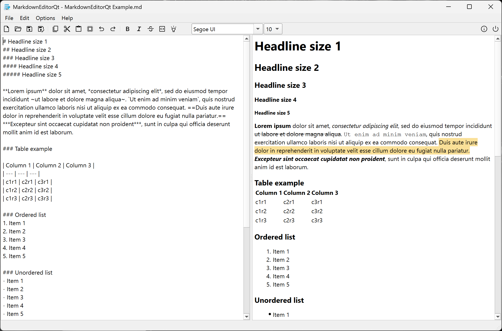

### MarkdownEditor (Qt) - (w) 2025 Jan Buchholz 

MarkdownEditorQt is a Qt6-based application for editing and previewing Markdown documents.
- Built on the md4c and md4c-html libraries for fast and accurate HTML generation
- Supports embedded images in PNG, JPEG, WebP, and SVG formats
- Fully aligned with the CommonMark standard, with highlighting emulated via HTML tags
- Includes a live preview feature (screenshot shows editing of the README.md for EmbyExplorerQt)

[Special thanks to Martin Mitáš (mity) and all contributors to the md4c library.](https://github.com/mity/md4c)

